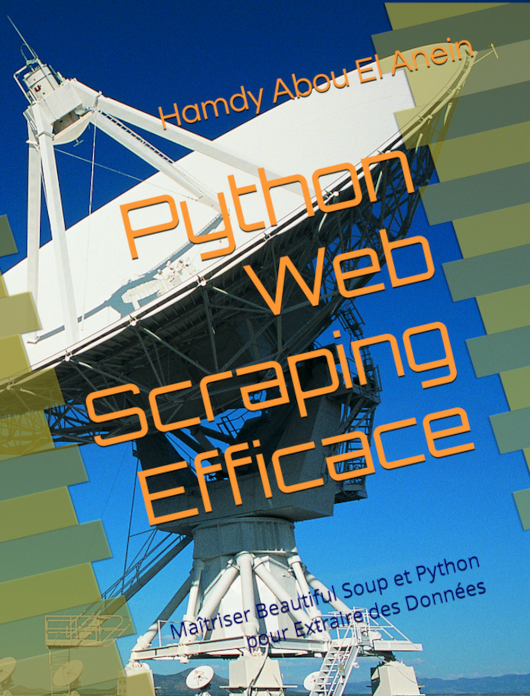

# Programmes du livre : [Python Web Scraping Efficace: Maîtriser Beautiful Soup et Python pour Extraire des Données](https://www.amazon.fr/dp/B0C3JDK5QF)      
[](https://www.amazon.fr/dp/B0C3JDK5QF)       
   
Auteur : [Hamdy Abou El Anein](https://www.amazon.fr/Hamdy-Abou-El-Anein/e/B0BM89T88X/ref=aufs_dp_fta_dsk)    
   
## Installation    
   
  ```sh   
pip install requierements.txt
  ```     
   
## Lancement du programme principal   
    
  ```sh   
python BooktoScrape.py   
  ```  

